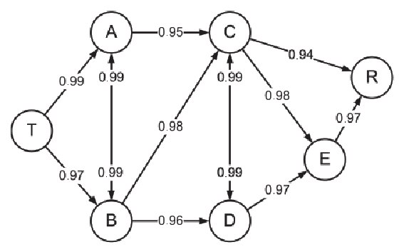

# TP UNA 2023-2

<!--toc:start-->
- [TP UNA 2023-2](#tp-una-2023-2)
  - [Ejercicios](#ejercicios)
    - [Ejercicio 1](#ejercicio-1)
    - [Ejercicio 2](#ejercicio-2)
    - [Ejercicio 3](#ejercicio-3)
  - [Como compilar el proyecto](#como-compilar-el-proyecto)
    - [Clonar el repositorio](#clonar-el-repositorio)
    - [Crear la carpeta build y ejecutar cmake para que se configure](#crear-la-carpeta-build-y-ejecutar-cmake-para-que-se-configure)
    - [Compilar el proyecto](#compilar-el-proyecto)
<!--toc:end-->

## Ejercicios

1. ### Ejercicio 1
En la red de una Empresa que se muestra en la figura adjunta se ha indicado en cada
enlace la probabilidad de que esté operativo (de que no fallen).

 

Teniendo en cuenta que los fallos en enlaces diferentes son independientes entre sí se pide
encontrar, u sa n do el algoritmo de Dijkstra, la ruta de máxima fiabilidad entre los nodos T y
R

2. ### Ejercicio 2
Dada una matriz de 20 x 20 cuyos elementos son letras Mayúsculas y Minúsculas, hacer un
programa en lenguaje C++ que permita ordenar ascendente de acuerdo a su código ASCII.
Nota: Utilice el método de búsqueda de su preferencia

3. ### Ejercicio 3
Realizar un programa en C++ que, dadas 2 matrices iguales de N x M llenarla con valores
aleatorios numéricos, buscar secuencialmente y contar cuantos de estos valores son pares y
cuantos son mayores a cero.

## Como compilar el proyecto
El proyecto usa [Cmake](https://cmake.org/) como build system, asi que asegurense de tenerlo instalado antes de iniciar con los pasos

1. ### Clonar el repositorio
```bash
git clone https://github.com/ElReyDelJoropo/TPS-324-2023-2.git
cd TPS-324-2023-2
```

2. ### Crear la carpeta build y ejecutar cmake para que se configure
```bash
mkdir build
cd build
cmake ..
```

3. ### Compilar el proyecto
```bash
cd ..
cmake --build build
```
Con eso obtendriamos nuestro ejecutable en la carpeta build/
